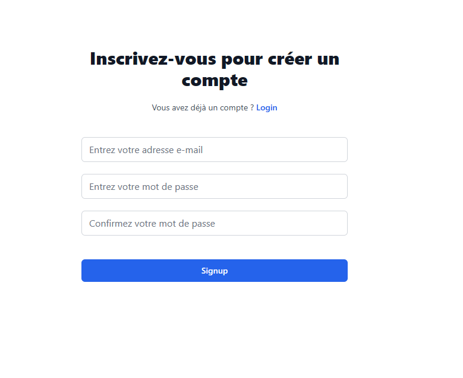
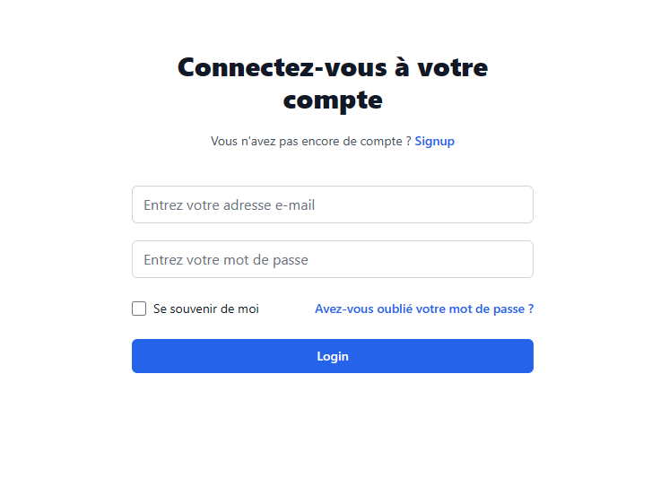

```markdown
# Formulaire de Connexion/Inscription Moderne avec Tailwind CSS et React

Ce projet vise à créer un formulaire de connexion et d'inscription moderne en utilisant React comme bibliothèque JavaScript frontale et Tailwind CSS pour le design et la mise en page.

## Fonctionnalités

- **Formulaire de Connexion :** Permet aux utilisateurs existants de se connecter à l'application en saisissant leur email et mot de passe.
- **Formulaire d'Inscription :** Offre la possibilité aux nouveaux utilisateurs de créer un compte en fournissant leur nom, email et mot de passe.
- **Validation des Entrées :** Effectue une validation côté client pour les champs obligatoires et les formats d'email et de mot de passe.

## Prérequis

- Node.js installé sur votre machine
- NPM ou Yarn pour gérer les dépendances du projet

## Installation

1. **Cloner le dépôt :**
   ```bash
   git clone https://github.com/votre-utilisateur/formulaire-connexion-inscription.git
   ```

2. **Installer les dépendances :**
   ```bash
   cd formulaire-connexion-inscription
   npm install   # ou yarn install
   ```

3. **Lancer l'application :**
   ```bash
   npm start   # ou yarn start
   ```

4. **Accéder à l'application :**
   Ouvrez votre navigateur et accédez à `http://localhost:3000` pour voir le formulaire en action.

## Technologies Utilisées

- React : Bibliothèque JavaScript pour la construction d'interfaces utilisateur.
- Tailwind CSS : Framework CSS utilitaire pour la conception rapide et moderne.
- Autres bibliothèques : React Router, PropTypes (ou TypeScript pour la typage), etc.

## Structure du Projet

- `/src` : Contient le code source de l'application.
  - `/components` : Composants React réutilisables pour les formulaires.
  - `/constant`
  - `/pages` : Pages de l'application, notamment les pages de connexion et d'inscription.
  - `/styles` : Fichiers de styles spécifiques ou personnalisés.
  - `/utils` : Utilitaires ou fonctions d'aide.

## Contribution

Si vous souhaitez contribuer à ce projet, veuillez ouvrir une issue pour discuter des changements que vous souhaitez apporter ou soumettre une demande de tirage (pull request) directement.
